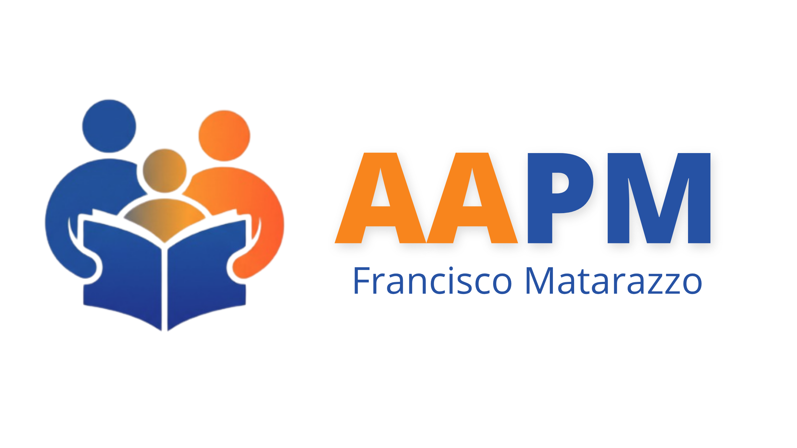

<div align="center">



# AAPM · Gestão e Ponto de Venda

**Vendas, estoque e administração em uma experiência web integrada.**

[](https://www.python.org/)
[](https://fastapi.tiangolo.com/)
[](https://www.sqlalchemy.org/)
[](#estado-do-projeto)

Sistema desenvolvido para a **Associação de Alunos, Ex-Alunos, Pais e Mestres**<br>
do SENAI Francisco Matarazzo · São Paulo/SP

</div>

---

## Uma operação simples, do balcão à gestão

O AAPM conecta o atendimento do PDV ao controle administrativo. Quem vende encontra um fluxo direto para registrar pedidos; quem administra acompanha produtos, associados, estoque, equipe e indicadores no mesmo sistema.

| No balcão | Na administração | Nos bastidores |
|---|---|---|
| Venda rápida e identificação de associados | Dashboard, gráficos e relatórios | API REST versionada |
| Desconto automático de associado | Produtos, categorias e variações | Autenticação JWT |
| Baixa de estoque durante a venda | Usuários e permissões por área | SQLAlchemy + Alembic |
| Exceções e prazos de pagamento | Pedidos, clientes e movimentações | Integrações SMTP e OpenAI |

> Você acessa o sistema pelo navegador. A interface conversa com uma API FastAPI, que valida permissões, executa as regras e persiste os dados de forma transacional.

## Como o sistema se organiza

| Experiência | Aplicação | Dados |
|---|---|---|
| **HTML + CSS + JavaScript**<br>Telas responsivas do PDV e dashboard, renderizadas com Jinja2. | **FastAPI**<br>Rotas web, API `/api/v1/pdv`, autenticação e regras operacionais. | **SQLAlchemy**<br>Modelos relacionais e evolução do esquema controlada por Alembic. |
| `apps/pvd/` | `database/main.py` · `api/v1/` | `database/models/` · `migrations/` |

O projeto adota um **monólito modular**: interface, API, segurança e persistência ficam separadas por responsabilidade, mas são publicadas pela mesma aplicação. A visão completa, incluindo os 11 modelos e seus relacionamentos, está em [docs/arquitetura.md](docs/arquitetura.md).

## Recursos que você encontra

| Operação comercial | Controle administrativo |
|---|---|
| **PDV** — produtos, variações, carrinho e fechamento | **Dashboard** — métricas diárias, séries horárias e destaques |
| **Associados** — busca por matrícula e desconto de 10% | **Catálogo** — produtos, imagens, categorias, preços e status |
| **Pedidos** — histórico e dados preservados da venda | **Estoque** — entradas, saídas e trilha de movimentações |
| **Pagamentos** — exceções, prazo, observação e quitação | **Equipe** — perfis, ativação e permissões por seção |
| **Atendimento** — notificações de pendências | **AAPM Smart** — insights e assistente integrado |

## Coloque para funcionar

Você precisa do **Python 3.10 ou superior**, `pip` e uma URL de banco compatível com SQLAlchemy.

```powershell
# 1. Crie e ative o ambiente virtual
python -m venv .venv
.\.venv\Scripts\Activate.ps1

# 2. Instale as dependências
pip install -r requirements.txt

# 3. Aplique as migrations
alembic upgrade head

# 4. Inicie a aplicação
python -m uvicorn database.main:app --reload
```

Abra **http://localhost:8000**. Durante o desenvolvimento, a documentação interativa da API fica disponível em **http://localhost:8000/docs**.

### Configuração essencial

Crie um arquivo `.env` na raiz. Estes são os grupos de configuração usados pela aplicação:

| Banco e sessão | Recuperação de senha | Recursos externos |
|---|---|---|
| `DATABASE_URL` | `SMTP_HOST` · `SMTP_PORT` | Credenciais da OpenAI |
| `SECRET_KEY` | `SMTP_USER` · `SMTP_PASSWORD` | `APP_BASE_URL` |
| `ALGORITHM` | `SMTP_FROM` · `SMTP_TLS` · `SMTP_SSL` | `RESET_PASSWORD_BASE_URL` |
| `ACCESS_TOKEN_EXPIRE_MINUTES` | `SMTP_TIMEOUT` | — |

Não publique o `.env`: ele contém credenciais e chaves privadas. O banco utilizado é determinado por `DATABASE_URL`; o repositório possui suporte a PostgreSQL e um banco SQLite local.

## Acessos da aplicação

| Endereço | O que você encontra | Quem utiliza |
|---|---|---|
| `/auth/login` | Entrada e recuperação de acesso | Todos os usuários |
| `/pdv` | Atendimento e registro de vendas | Operadores e administradores |
| `/dashboard` | Gestão, indicadores e relatórios | Admin ou usuário autorizado |
| `/docs` | Contratos e testes da API | Desenvolvimento |

A sessão usa JWT em cookie HttpOnly. Administradores têm acesso integral; funcionários visualizam somente as áreas liberadas em suas permissões. As restrições são verificadas no servidor, não apenas escondidas na interface.

## Mapa rápido do código

```text
apps/pvd/                  interface, estilos, scripts e recursos visuais
api/v1/pvd.py              endpoints do PDV e do dashboard
database/main.py           composição e inicialização da aplicação
database/auth.py           JWT, senhas, sessão e autorização
database/controllers/      autenticação e administração de usuários
database/models/           entidades SQLAlchemy
migrations/                histórico do esquema do banco
tests/                     testes automatizados
docs/                      arquitetura e requisitos
```

## Desenvolvimento

Antes de entregar uma mudança, mantenha três pontos alinhados: o modelo SQLAlchemy, a migration Alembic e o contrato consumido pelo frontend. Para validar o projeto:

```powershell
python -m pytest
```

As regras financeiras devem preservar o histórico da venda; alterações futuras de produto ou preço não podem modificar pedidos já registrados. Novas rotas do domínio permanecem sob `/api/v1/pdv`, e toda autorização deve ser confirmada no backend.

| Quero entender… | Consulte |
|---|---|
| Componentes, fluxos e modelos de dados | [Arquitetura técnica](docs/arquitetura.md) |
| Requisitos funcionais, não funcionais e regras de negócio | [Especificação de requisitos](docs/requisições.md) |
| Evolução das tabelas | [`migrations/versions`](migrations/versions) |

## Estado do projeto

Login, dashboard, PDV, produtos, variações, categorias, associados, estoque, pedidos, exceções de pagamento e gestão de usuários estão implementados. Relatórios e cobertura automatizada continuam em evolução.

<div align="center">

---

**AAPM · tecnologia a serviço da comunidade escolar**<br>
SENAI Francisco Matarazzo · 2026

</div>
